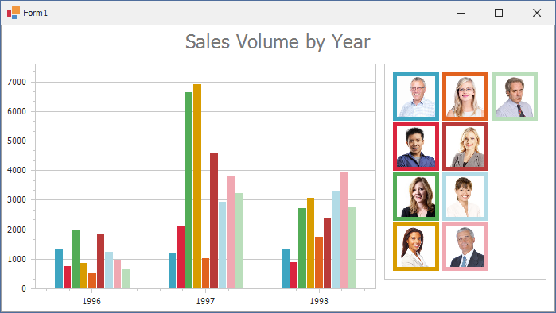

<!-- default badges list -->

<!-- default badges end -->

# Chart for WinForms - Draw a Custom Legend Marker for a Series

This example demonstrates how to use the [CustomDrawSeries](https://docs.devexpress.com/WindowsForms/DevExpress.XtraCharts.ChartControl.CustomDrawSeries?v=22.2&p=netframework) event to modify the legend markers of bar series.

Assign a custom legend marker to the [LegendMarkerImage](https://docs.devexpress.com/CoreLibraries/DevExpress.XtraCharts.CustomDrawSeriesEventArgsBase.LegendMarkerImage?p=netframework) property. Set the [DisposeLegendMarkerImage](https://docs.devexpress.com/CoreLibraries/DevExpress.XtraCharts.CustomDrawSeriesEventArgsBase.DisposeLegendMarkerImage?p=netframework) property to `true` to avoid memory leaks. To customize options used to draw the series, cast [e.SeriesDrawOptions](https://docs.devexpress.com/CoreLibraries/DevExpress.XtraCharts.CustomDrawSeriesEventArgsBase.SeriesDrawOptions) to the
[DrawOptions](https://docs.devexpress.com/CoreLibraries/DevExpress.XtraCharts.DrawOptions?v=22.2) class descendant that stores draw options of the required series view type.

## Files to Review

* **[Form1.cs](./CS/CustomDrawingSample/Form1.cs) (VB: [Form1.vb](./VB/CustomDrawingSample/Form1.vb))**
* [Employee.cs](./CS/CustomDrawingSample/Model/Employee.cs) (VB: [Employee.vb](./VB/CustomDrawingSample/Model/Employee.vb))
* [NwindDbContext.cs](./CS/CustomDrawingSample/Model/NwindDbContext.cs) (VB: [NwindDbContext.vb](./VB/CustomDrawingSample/Model/NwindDbContext.vb))
* [Order.cs](./CS/CustomDrawingSample/Model/Order.cs) (VB: [Order.vb](./VB/CustomDrawingSample/Model/Order.vb))

## Documentation 

[Legend Marker](https://docs.devexpress.com/WindowsForms/1985/controls-and-libraries/chart-control/visual-elements/legend-marker?p=netframework)
